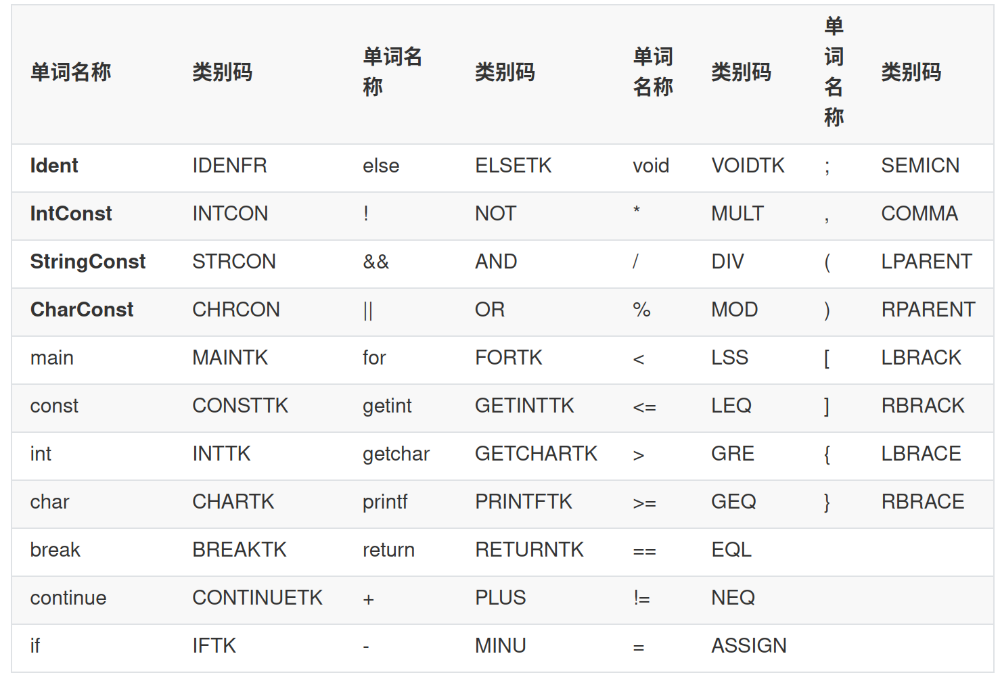

# BUAA-2024-Compiler
刘思涵 22371386  
## 前言
## 文法解读

## 词法分析
这是编译器项目中的第一个要完成的部分，也是建立整个编译器架构的时机  
在此，我按照课程分类，结合实际编译器的设计，也将代码分为词法分析，语法分析，中间优化，目标代码生成四个部分  
除此之外，还有公用的错误处理，符号表管理，输入输出和工具类几个部分  
我这样设计的目的是为了能够尽可能解耦各个部分，使得每一次作业都能够只进行增量开发，但不要修改原有代码  
如果被迫需要修改原有代码，也尽可能不要影响程序其他部分功能  
### 词法组成
根据作业页面定义，本次作业中的词法一共包含以下部分：

其中可以分为以下几个类别：
1. 数字开头：IntConst
2. 双引号开头：StringConst
3. 单引号开头：CharConst
4. 字母，下划线开头：分为关键字（main，const，...）或者标识符（Ident）  
5. 单符号：例如（+，-，*，/）
6. 单或多符号：例如（&&，||，<，<=）    

然而字符串是由双引号包裹，其中几乎包含任何字符，只需要注意双引号和反斜杠    
字符由单引号包裹，其中包含一个或者两个字符  
数字只由数字组成，标识符只由字母，下划线和数字组成，关键字只由字母组成  
因此只需要将定义中的分割符作为界限，其余全部划分为单词，再由词法分析程序处理即可

### 词法分析程序设计
在词法分析程序部分，我主要分为两部分，其一是字符处理部分（IO），其二是词法分析部分（Lexer）  
#### IO
这部分用于从制定的位置读取字符，并且将连续的字符组合成为一系列单词  
根据上面词法组成的部分可知，一个单词主要由分割符决定  
1. 在分割符和空白符之间的连续字母，数字，下划线可以视为一个单词
2. 分割符自身可以被视为一个单词
3. 双引号之间，单引号之间被视为一个单词
4. 注释符号之间被视为一个单词（但忽略）  

为了实现以上功能，并且尽可能将分别单词的任务交给词法分析程序，我在IO部分设置了可以自由规定可忽略分割符和不可忽略分割符的读取函数
### 接口  
建立在解耦各个模块的目的上，我为每一个模块设置了各自的接口，对于模块外部所说，应当只有接口和构造函数可见  
#### ErrorLog
错误处理部分功能的接口，因为还没有做到错误处理部分，目前的任务只需要记录特定报错的信息和位置，所以只设置了两个函数  
1. 记录错误信息
```java
public void log(CompilerError error);
```
用于向日志提交一个错误，错误内容按照CompilerError模板填写
CompilerError:
```java
public class CompilerError {

    protected final int line;

    protected final String message;

    public CompilerError(int line, String message) {
        this.line = line;
        this.message = message;
    }

    public int getLine() {
        return line;
    }

    public String getMessage() {
        return message;
    }
}
```
目前只需要记录错误信息和位置  
2. 打印错误报告  

用于在程序结束后将错误内容输出到error.txt  
```java
public void print(OutputSystem outputSystem);
``` 
需要指定输出系统，决定输出到哪个位置  
#### IO  
1. 输入一行

从当前位置，直到行末，不包括换行符  
```java
    /**
     * 得到一行，基于评测机要求，以'\n'为截至，返回值不包含'\n'
     * @return 当前行剩余内容，不包括换行符
     */
    public String getLine();
```
2. 输入一个单词  

可以自定义分割符，也可以使用默认分割符
```java
    /**
     * 得到一个单词，默认以空白符为分割，例如'\n' '\t' '\r' '\v' '\f' ' '
     * @return 以分割符隔开的单词，自动换行，不包括空白符
     */
    public String getWord();

    /**
     * 得到一个单词，但是以输入的字符为分割，默认不包括空白符
     * 在结束时得到null
     * @param noKeepSeparators 作为分割的符号集合，不作为单词输出
     * @param keepSeparators 作为分割的符号集合，作为单词输出
     * @return 以分割符隔开的单词，自动换行
     */
    public String getWord(char[] noKeepSeparators, char[] keepSeparators);
```
3. 更换默认分割符  

初始默认为只有空白符，因为程序中，主要由文法中的符号进行分割，所以可以修改  

```java
    /**
     * 重新声明默认分割符
     * @param noKeep 跳过的分割符（空白符）
     * @param keep 保留的分割符
     */
    public void setDefault(char[] noKeep, char[] keep);
```
4. 回退一个单词  

用于在试探性读取下一个单词时，注意只能使用一次，并且使用之后需要再取下一个词  
```java
    /**
     * 返回上一个单词，返回null表示前面没有单词，开头使用会导致getWord错误
     * 在下一次getWord之前，不要使用其他方法
     * 下一次getWord会返回当前单词
     * @return 上一个单词
     */
    public String backward();
```
5. 读取一个字符  

用于细微调整，例如读取反斜杠之后的转义字符  
```java
    /**
     * 返回一个字符，包括空白符
     * @return 得到的字符
     */
    public String getChar();
```
6. 得到当前单词行数  

用于报错时定位，注意，得到的是当前指向单词的位置（下一个单词的位置）  
```java
    /**
     * 得到当前行
     * @return 当前读取的行（尚未读取的部分所在行）
     */
    public int getRow();
```
7. 输出系列函数

用于在不同输出方向的公用函数  
```java
    /**
     * 基本打印函数
     * @param s 打印字符串
     */
    public void print(String s);

    /**
     * 基本换行打印函数
     * @param s 打印字符串
     */
    public void println(String s);

    /**
     * 换行
     */
    public void println();
```
8. Token及Error输出  

特别为本次作业需要的两种输出提供功能  
```java
    /**
     * 错误打印函数
     * @param error 编译错误
     */
    public void error(CompilerError error);

    /**
     * Token打印函数
     * @param token Token
     */
    public void Token(Token token);
```
#### Lexer
词法解析程序，包括Token模板，Token种类枚举，Lexer方法几部分  
1. Token模板

```java
public class Token {

    // 类别码
    private final TokenType type;

    // 单词的字符，字符串，数字
    private final String value;

    /**
     * 声明一个标准的Token
     * @param type Token类别码
     * @param value Token的具体内容
     */
    public Token(TokenType type, String value) {
        this.type = type;
        this.value = value;
    }

    public TokenType getType() {
        return type;
    }

    public String getValue() {
        return value;
    }
}
```  
2. TokenType枚举

```java
public enum TokenType {
    IDENFR, INTCON, STRCON, CHRCON,
    MAINTK, CONSTTK, INTTK, CHARTK, BREAKTK, CONTINUETK, IFTK, ELSETK,
    NOT, AND, OR,
    FORTK, GETINTTK, GETCHARTK, PRINTFTK, RETURNTK,
    PLUS, MINU,
    VOIDTK,
    MULT, DIV, MOD, LSS, LEQ, GRE, GEQ, EQL, NEQ, ASSIGN, SEMICN, COMMA,
    LPARENT, RPARENT, LBRACK, RBRACK, LBRACE, RBRACE
}
```
3. 获得下一个Token  

本次词法分析使用语法分析相互交互的模型  
指挥词法分析程序，从文件中读取单词，并解析成为下一个Token（如果之前回退过，会回到当前位置）  
```java
    /**
     * 取出下一个Token
     * @return 下一个Token，null表示结束
     */
    public Token nextToken();
```
4. 获取上一个Token  

上上次输出的Token（上一次输出为当前Token），不会改变指针位置  
```java
    /**
     * 取出上一个Token
     * @return 上一个Token，null表示不存在
     */
    public Token previousToken();
```
5. 预览下一个Token

不会改变当前的指针位置，得到下一个Token的内容  
```java
    /**
     * 预览下一个Token，不改变当前指针位置
     * @return 下一个Token，null表示结束
     */
    public Token previewToken();
```
6. 重新取出当前位置Token内容  

```java
    /**
     * 取出当前Token，不改变当前指针位置
     * @return 当前Token，null表示尚未开始，或者结束
     */
    public Token getToken();
```
### 其余函数功能

## 语法分析  

### 语法树  
语法分析部分的主要目的在于，将判断词法分析得到的结果是否符合语法的定义顺序  
在忽略部分缺少符号的错误之后，将剩下的内容，按照语法整合成语法树  
为了更方便的整理语法树，我做了一些修改：  
1. 所有的Token和非终结符都属于元素，因此可以将元素作为单位组织树  
2. 额外添加了基本的Int，Char，String常量的非终结符，在之后的使用中，读取非终结符即可获得常量  
3. 在根据语法，进行下一步解析时，直接调用对应语法成分的of方法，会自动调用词法，应对不限长度的语法成分  

### 接口  
本次在之后会被调用的内容比较单一，基本存在于生成的语法树中，因此语法树包含部分接口方法，语法解释器也包含部分方法  

#### Parser  

1. 开始解析  
```java
    public ParseTree parse() throws Exception;
```

在声明一个语法解析器后，直接调用parse方法开始解释，会返回一个完整的语法树  

#### pt

1. 开始解析
```java
    /**
     * 开始解析
     */
    public void parse();
```

2. 按树状结构打印语法树
```java
    /**
     * 按树状结构打印内容
     */
    public void print();
```

更直观的展示语法树的结构，但与课程要求不同  
3. 按平面打印语法树
```java
    /**
     * 按平面格式打印内容（忽略课程要求内容）
     */
    public void printAns();
```  

和课程要求相同  
4. 返回根节点  
```java
    /**
     * 返回语法树的根节点（CompUnit）
     * @return 根节点
     */
    public Symbol getSymbol();
```  

得到CompUnit，同时也可以作为元素进行遍历

#### 语法树结构

在分析得到的语法树中，基本组成单位是Ele接口，但是此类只是一个共用的接口，用来构成树状结构，其中两个方法：  
1. 返回当前行

```Java
    public int getLine();
```
2. 生成字符串

```Java
    public String toString();
```

当前行表示的该语法结构在源代码中的行位置，用于错误处理，输出字符串用于生成中间答案

继承Ele接口的是Token和Symbol两个类，分别表示Token和非终结符两种成分，因为在语法树中，我们还需要记录终结符成分，所以我们直接记录Token即可

除此之外，每一个非终结符Symbol还含有of方法，表示从当前位置开始，读取Token并分析生成语法成分，在多数情况下，First集合不会冲突，所以可以正常生成，而不需要回溯。但是在CompUnit的声明部分，以及LVal和Exp之类的表达式部分，还是可能出现冲突的情况，需要设置回溯功能（所以还是添加了Lexer的回溯）    

## 语义分析

从这里开始，我们需要将无意义的语法成分转变成为带有具体语义含义的部分，主要实现方式是通过：  
1. 符号表管理
2. 类型错误处理
3. 参数错误处理  

我们需要根据语法的层次和位置，决定当前语法表示的语义，并且建立和维护符号表

### 符号表设计

在这里，我选择使用栈式符号表，但是实现方式略有不同  
首先，全局符号表是最底层的符号表，所有其他符号表都建立在其上  
其次，每一个函数都需要对应的符号表，相互独立，具体内容通过形参和实参的转化来传递，而不需要将函数符号表建立在调用函数语句处  
再次，每一个函数内部，按照代码块的结构，形成一层层嵌套的符号表  
总而言之，我们需要建立一个能够体现出嵌套结构，可以相互独立，而且能够长时间保存和查找的符号表。因此，我选择使用类似url的地址表示符号表的位置，根据对应符号表的内容，其地址可以轻松计算出来，再根据地址直接寻路找到符号表  
符号表内部需要保存当前空间内声明的变量和常量，而寻找对应变量时，按照地址自后向前的顺序逐渐往前搜索，直到根符号表，也就是全局符号表  
每一个变量，常量保存的内容或有不同，主要都包括在info类中，具体保存内容可以之后再声明

### 语义分析程序设计

语义分析的内容

## 中间代码生成

### IR设计

op | arg1 | arg2 | result | 说明  
---|---|---|---|---
im|数值|空|结果|结果=数值
add|参数1|参数2|结果|结果=参数1+参数2
sub|参数1|参数2|结果|结果=参数1-参数2
mult|参数1|参数2|结果|结果=参数1*参数2
div|参数1|参数2|结果|结果=参数1/参数2
mod|参数1|参数2|结果|结果=参数1%参数2
gre|参数1|参数2|结果|结果=参数1>参数2
lss|参数1|参数2|结果|结果=参数1<参数2
geq|参数1|参数2|结果|结果=参数1>=参数2
leq|参数1|参数2|结果|结果=参数1<=参数2
eql|参数1|参数2|结果|结果=参数1==参数2
neq|参数1|参数2|结果|结果=参数1!=参数2
and|参数1|参数2|结果|结果=参数1&参数2
or|参数1|参数2|结果|结果=参数1|参数2
not|参数1|空|结果|结果=!参数1
decl|参数名|参数类型|长度|声明一个参数，如果是数组则需要类型和长度，否则为0如果是常量后面一行跟随对应数值
values|参数名|数据|空|用于填写声明的数据，数据类型可能是数组，字符串，字符，或者数字
def|函数名|空|空|声明函数，后续跟随一系列fpara
fpara|参数名|维度|参数类型|声明形参，如果是数组需要长度和类型
ret|参数名|空|空|返回一个参数，如果为Void则参数为空
exit|空|空|空|表示返回函数，处理栈空间，以及返回值，由ret跳转
rpara|参数名|空|空|依次填充函数实参
call|函数名|空|空|先使用rpara将参数入栈
getrt|空|空|结果|将函数返回值加载到结果
bez|参数1|空|块名|如果参数1==0则跳转到块名
j|空|空|块名|直接跳转块名
label|标签名|空|空|声明标签
be|指令|空|空|结束声明或结束参数
get|指针|位置|参数|新指令，用于解引用指针，取出对应数据
put|指针|位置|参数|新指令，用于解引用指针，存放对应数据


在生成的中间代码中：
1. `#`表示注释，后面一行内容无用，可以直接复制到mips文件中
2. `$`表示代码块内容，包括声明，结束，以及跳转关系
3. 直接写的四元式为中间代码


### 跳转设计

1. 循环

因为只涉及for循环，所以大致架构为
```
BLOCK 0 {
    ...
    for_stmt1
}

BLOCK 1 {
    cond
    bez 4 如果不满足条件
}

BLOCK 2 {
    stmt...
}

BLOCK 3 CONTINUE BLOCK {
    for_stmt2
    j 1
}

BLOCK 4 BREAK BLOCK{
    ...
}
```

2. 判断

设计单纯if和if else两种

if:
```
BLOCK 0 {
    cond 
    bez 2 如果不满足条件
}

BLOCK 1 {
    stmt...
}

BLOCK 2 {
    ...
}
```

if else:
```
BLOCK 0 {
    cond 
    bez 2 如果不满足条件
}

BLOCK 1 {
    stmt...
    j 3
}

BLOCK 2 {
    else_stmt...
}

BLOCK 3 {
    ...
}
```

3. 函数调用

def:
```
BLOCK func_name {
    fpara... 声明形参，用于建立符号表和内存偏移量
    在函数定义之前
    ...
    ret ans 将对应内容填充到返回值寄存器，jr跳转回下一条
}

```

call:
```
BLOCK 0 {
    rpara...
    call func_name
}

BLOCK 1 {
    getrt ans
}
```

4. 短路求值  

||:
```
BLOCK 0 {
    ...
    LOr -> t1
    not <- t1 -> t2
    bez 2 <- t2
}

BLOCK 1 {
    LAnd -> t1
}

BLOCK 2 {
    ...
}
```

&&:
```
BLOCK 0 {
    ... 
    LAnd -> t1
    Bez 2 <- t1
}

BLOCK 1 {
    Eq -> t1
}

BLOCK 2 {
    ...
}
```

### 代码块设计

每个代码块包含一系列完整且不会跳转的指令  
在每一个语法成分的visit中，都需要irBlock代表其所在代码块  
代码块由上一层根据当前成分的符号表申请，在FuncDef，MainFuncDef，Block等内部不需要申请代码块  
因为代码块的标签和函数名略有不同，因此通过def语句，在后端再次生成新标签  
Block结束后的新代码块在进入Block之前声明  
ret后面可能跟随一些无用代码，注意删去  

### 函数调用设计

在语义分析时，判断提取所有函数中声明的变量，在函数入口初始化时，将所有变量保存到栈中  
函数调用者需要保存所有的全局寄存器，包括s0-s7，并为这些内容申请栈空间  
调用后需要将内容弹出栈，保存原内容不变，v0-v1寄存器用以保存返回值  
在目前的简单汇编器中，暂时不考虑a0-a3,及寄存器分配的内容，尽可能用内存  
被调用函数内部，首先根据函数需要的变量空间，在栈空间中申请位置，并且保存栈顶指针，通过该指针和偏移值，得到每一个变量的位置    
除此之外，还需要根据使用的t0-t7寄存器数量，以及ra申请寄存器空间，但是在简单的汇编器中，暂时不使用临时寄存器  
在函数返回前，需要将返回值保存到v0-v1，并且弹出在函数内申请的空间  
| 层次 | 名称 | 内容 |
| --- | --- | --- |
| 0 + n | reg | 函数内保存的寄存器，t0-t7, ra，函数内部填充 |
| reg + n | dec | 函数内声明的参数，函数内部填充 |
| reg + dec + n | rpara | 传入的参数，包括a0-a3的空间，调用者填充，函数可见 |
| reg + dec + rpara + n | saved | 保存的全局寄存器，包括s0-s7，调用者填充，函数不可见 |

1. 调用者填充

```
unmark (p1 = decls + push regs)
{
    push regs2
}
unmark (p2 = decls + push regs + push regs2)
p = p2 - p1 (p = push regs2)
addi $sp $sp -p
save regs2
{
    push rpara
    addi $sp $sp -4
    save rpara
}

call

load regs2
unmark (p3 = decls + push regs + push regs2 + push rparas)
p = p3 - p1 (p = push regs2 + push rpara)
addi $sp $sp p
```

2. 函数内部填充

```
def
fparas
mark
{
    decls
    push regs
}
unmark (p = decls + push regs)
addi $sp $sp -p
save regs

...

load regs
unmark (p = decls + push regs)
addi $sp $sp p
jr $ra
```

### 简单汇编器

1. 使用虚拟栈模拟在该函数中参数的相对位置，并自动生成取，存指令
2. 因为还没有做寄存器的优化，所以这里将所有目标记为s0,第一个和第二个参数分别是s1,s2
3. 因为不需要实现函数中不定长的数组声明，因此直接在第一个函数声明块中声明所有参数，用于控制栈，最后一个销毁块中恢复栈

### 基本函数

1. printf
```
printf:
addi $sp $sp -20
sw $ra 16($sp)
sw $t0 12($sp)
sw $t1 8($sp)
sw $t2 4($sp)
sw $t3 0($sp)

lw $t0 20($sp) # num
sll $t0 $t0 2 
add $t0 $t0 $sp
addi $t0 $t0 20
lw $s1 0($t0) # char *s
li $t1 37 # %
li $t2 99 # c
li $t3 100 # d

__printf__loop1:
lb $a0 0($s1) # *s
beq $0 $a0 __printf__loop__end # *s == 0 return
beq $t1 $a0 __printf__per 
jal __putchar__

__printf__loop2:
addi $s1 $s1 1 # s++
j __printf__loop1

__printf__per: # *s == '%'
addi $s1 $s1 1 # s++
lb $a0 0($s1) # *s
beq $0 $a0 __printf__per__end # *s == 0
beq $t2 $a0 __printf__c # *s == 'c'
beq $t3 $a0 __printf__d # *s == 'd' 

add $a1 $a0 $zero
li $a0 37 
jal __putchar__ # put %

add $a0 $a1 $zero
jal __putchar__ # put *s (not c, d)

j __printf__loop2

__printf__per__end:
li $a0 37 
jal __putchar__ # put %

j __printf__loop__end

__printf__c:
addi $t0 $t0 -4
lw $a0 0($t0)
jal __putchar__ 

j __printf__loop2

__printf__d:
addi $t0 $t0 -4
lw $a0 0($t0)
jal __putint__ 

j __printf__loop2

__printf__loop__end:
lw $ra 16($sp)
lw $t0 12($sp)
lw $t1 8($sp)
lw $t2 4($sp)
lw $t3 0($sp)

addi $sp $sp 20
jr $ra

__putchar__:
li $v0 11
syscall 
jr $ra

__putint__:
li $v0 1
syscall
jr $ra
```

```C
char s[];
for(int i = 0)
```

2. getint
```
getint:
li $v0 5
syscall
jr $ra
```

3. getchar
```
getchar:
li $v0 12
syscall
jr $ra
```
### TODO

现在printf字符串中的\n会占用两个字符，在表示时可以删除，申请空间时也要删除
在stmt后面跟//注释会出现空指针

## 代码优化

### 代码重构

因为在上一次作业中，接触到实际编译过程中的各个环节与需求，因此在本次作业，将对大部分代码进行完善

#### IRBlock

作为一个中间代码块的单位，其中需要保存代码块的名称，所属函数，以及所在符号表

同理还要保存定义和使用变量名称，以及代码块间跳转关系，用于之后的数据流和控制流分析

本次所有变量声明需要符合SSA标准，中间变量通过代码块生成，一次生成代表一次赋值，后续跟随一系列使用

被赋值变量需要生成新名称，后续使用phi函数选择来源

#### Quadruple

四元式数据结构，优化为可以根据参数数量决定构造函数，而且不在外部生成，仅作为便于保存的数据元组使用

### 块内优化

#### 代数变换

#### 运算优化

#### 复写传播

#### 删除冗余代码

#### 消除公共子表达式

### 全局优化

#### 数据流分析

#### 到达定义分析

#### 活跃变量分析

#### 使用链，网和冲突图

#### 全局公共子表达式

### 循环优化

#### 不变式代码外提

#### 循环展开

#### 归纳优化变量替代

### 内联展开

### SSA表达式

根据教程提供的SSA表达式替换方法，其中消除phi被放在中段，直接跳转对应关键边的中间块
